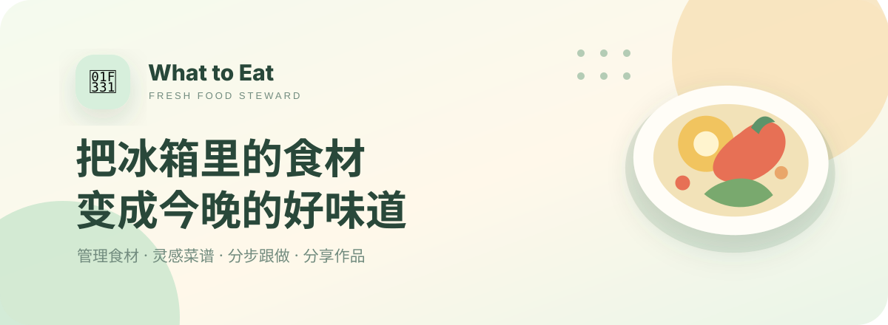

<div align="center">
  

  <br>

  <strong>会管理冰箱，也会陪你做饭的家庭食品管家</strong>

  <br><br>

  
  
  
  
</div>

## 🌱 关于「先吃」

打开冰箱却不知道吃什么？「先吃」把食材管理、菜谱灵感、分步跟做和做饭记录放进一个清新可爱的手机网页里。

它会提醒你哪些食材快到期，按现有食材推荐今晚能做的菜，并把复杂菜谱拆成容易执行的小步骤——让每一份食材都被好好吃掉。

> 少一点浪费，多一点认真吃饭的快乐。

## ✨ 功能亮点

| 功能 | 可以做什么 |
| --- | --- |
| 🧊 智能冰箱 | 拍照或手动添加食材，估算保质期、记录数量和金额 |
| 🍽️ 今晚推荐 | 用可互动的餐盘转盘，在多道推荐菜中选择晚餐 |
| 📖 灵感菜谱 | 浏览约 100 道家常菜，按菜名或现有食材寻找做法 |
| 👩‍🍳 分步跟做 | 查看具体用量、多人份换算和详细制作步骤；仅烹饪步骤提供计时 |
| 📷 厨友圈 | 拍摄真实成品照片、发布作品，并进行点赞、评论和分享 |
| 🔥 热量记录 | 输入食物名称和数量估算卡路里，也可直接录入热量 |
| 💰 减少浪费 | 记录每份食材金额，并统计被及时使用的食材价值 |
| 👤 手机登录 | 支持注册、登录、退出及刷新后保持登录状态 |

## 🥕 一次完整的使用流程

```text
登录 / 注册
    ↓
拍照识别或手动录入食材
    ↓
查看临期提醒与今晚推荐
    ↓
选择菜谱并调整用餐人数
    ↓
跟着步骤做菜，需要烹饪时再开启计时
    ↓
拍下真实成品，发布到厨友圈
```

## 🚀 本地体验

项目是静态手机网页，无需安装依赖或执行构建。

```bash
python3 -m http.server 8765
```

浏览器打开：[`http://127.0.0.1:8765`](http://127.0.0.1:8765)

### 体验账号

| 账号 | 密码 |
| --- | --- |
| `demo@xianchi.app` | `123456` |

也可以在登录页直接注册自己的本地体验账号。

## 📱 手机访问建议

- 在同一局域网内启动本地服务后，可用手机访问电脑的局域网地址。
- 部署到 GitHub Pages、Cloudflare Pages 或其他 HTTPS 服务后，可直接从手机浏览器打开。
- 相机功能需要 HTTPS 或本机 `localhost` 环境，并需要用户主动授权相机权限。

## 🗂️ 项目结构

```text
what-to-eat/
├── index.html                 # 手机网页版入口
├── src/
│   └── app-fragment.html      # 完整应用界面、样式和交互源码
├── assets/
│   └── readme-hero.svg        # README 品牌封面
└── README.md
```

## 🔐 登录与数据说明

当前版本用于产品原型演示：账号、登录状态和部分用户数据保存在浏览器 `localStorage` 中。

- 数据只保留在当前浏览器设备中。
- 清除浏览器网站数据后，本地账号和记录会被移除。
- 当前实现不适合直接存储真实敏感信息或投入生产环境。

正式上线时，建议接入 Supabase、Firebase 或自建后端，使用服务端身份认证、密码加密、数据库和跨设备同步。

## 🛣️ 下一步计划

- [ ] 接入正式用户认证与云端数据同步
- [ ] 使用视觉模型识别食材和预估新鲜度
- [ ] 增加营养目标、过敏原和饮食偏好
- [ ] 支持家庭成员共享冰箱
- [ ] 增加购物清单和菜谱收藏
- [ ] 部署为可添加到手机桌面的 PWA

---

<div align="center">
  <strong>🌿 先吃冰箱里的，再决定买什么。</strong>
</div>
