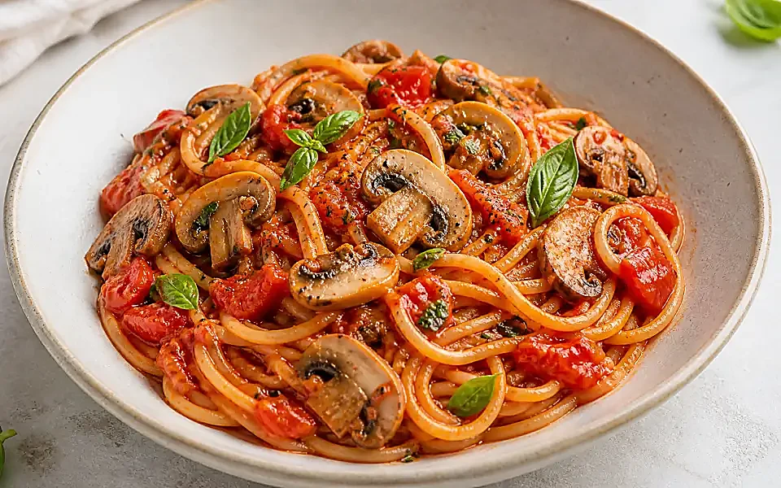

<div align="center">


# 🍳 What to Eat · 今天吃什么

### 从冰箱现有食材出发，把“吃什么”变成一件简单又有成就感的事。

[](https://xianchi-what-to-eat.jjhuang.chatgpt.site/?v=38-partial-delete)
[](https://react.dev/)
[](https://www.typescriptlang.org/)
[](https://developers.cloudflare.com/d1/)

[🌿 在线体验](https://xianchi-what-to-eat.jjhuang.chatgpt.site/?v=38-partial-delete) · [🛟 备用网站](https://xianchi-what-to-eat-backup.jjhuang.chatgpt.site/?v=1)

</div>

<br />

<table>
  <tr>
    <td width="50%"></td>
    <td width="25%"></td>
    <td width="25%"></td>
  </tr>
</table>

## ✨ 项目简介

**What to Eat** 是一个面向日常家庭做饭场景的移动端 Web App。用户可以记录冰箱食材、根据现有食材获得菜谱推荐、查看真实烹饪步骤，并通过做菜记录、作品分享和成就徽章持续获得动力。

项目目前收录 **100 道菜谱**，覆盖家常菜、主食、汤品和甜品，并针对手机使用体验进行了适配。

## 🥗 核心功能

| 功能 | 体验 |
| --- | --- |
| 🧊 **我的小冰箱** | 添加、分类和按数量删除食材，区分临期与未临期食品 |
| 🎯 **今晚推荐** | 根据冰箱里的真实库存动态推荐可做菜品 |
| 🔎 **智能菜谱搜索** | 支持菜名模糊匹配，也可以按手头食材寻找多种做法 |
| 📖 **真实烹饪流程** | 每道菜拥有独立步骤，复杂菜品不受固定步骤数量限制 |
| 📷 **真实食材与步骤图片** | 菜品、主要食材、器具和烹饪流程尽量与文字内容一致 |
| 🍰 **甜品专区** | 包含双皮奶、杨枝甘露、提拉米苏、巴斯克蛋糕等甜品 |
| 👩‍🍳 **厨艺成长体系** | 根据做菜次数和发布作品逐步提升厨艺等级 |
| 🏅 **成就徽章** | 12 枚可解锁徽章，点击即可查看获得条件和当前进度 |
| 💬 **厨友圈** | 双列作品流、真实菜品图片、评论互动与做菜心得分享 |
| 🔐 **独立账号数据** | 新用户从空冰箱、空记录和未解锁徽章开始，数据彼此隔离 |

## 🔐 注册与账号

- 用户需要先注册，才能使用邮箱和密码登录。
- 同一邮箱不能重复注册，已注册用户会被引导去登录。
- 密码使用 PBKDF2-SHA256 加盐哈希处理，不以明文保存。
- 注册验证码和忘记密码验证码通过 Brevo 邮件服务发送。
- 会话使用 `HttpOnly`、`Secure`、`SameSite=Lax` Cookie。

> 邮箱验证码功能需要在部署环境中正确配置 Brevo 发件人和相关密钥。

## 🧱 技术栈

- **前端：** React 19、TypeScript、CSS
- **应用框架：** vinext / Vite
- **服务端：** Cloudflare Workers 兼容运行时
- **数据库：** Cloudflare D1 + Drizzle ORM
- **邮件服务：** Brevo Transactional Email API
- **测试：** Node.js Test Runner + 构建验证

## 🚀 本地运行

### 环境要求

- Node.js `>= 22.13.0`
- npm

### 启动项目

```bash
git clone https://github.com/shuhuihuang0704/what-to-eat.git
cd what-to-eat
npm install
npm run dev
```

常用命令：

```bash
npm run dev                # 启动本地开发环境
npm run build              # 构建生产版本
npm test                   # 构建并运行测试
npm run lint               # 运行代码检查
npm run audit:step-images  # 检查菜谱步骤图片
npm run db:generate        # 生成数据库迁移
```

## ⚙️ 部署配置

部署时需要提供以下运行时绑定或 Secret：

| 名称 | 用途 |
| --- | --- |
| `DB` | Cloudflare D1 数据库绑定 |
| `BREVO_API_KEY` | Brevo 邮件发送密钥 |
| `AUTH_EMAIL_FROM` | 已在 Brevo 验证的发件邮箱 |
| `AUTH_EMAIL_NAME` | 发件人显示名称，默认 `What to Eat` |
| `AUTH_CODE_SECRET` | 验证码哈希密钥 |
| `TEMP_LOGIN_EMAIL` | 可选的临时测试账号邮箱 |
| `TEMP_LOGIN_PASSWORD` | 可选的临时测试账号密码 |
| `TEMP_LOGIN_NAME` | 可选的临时测试账号名称 |

> ⚠️ 不要把 API Key、密码或验证码密钥提交到 GitHub。请在部署平台的 Secret 设置中保存它们。

## 📁 项目结构

```text
what-to-eat/
├── app/                 # 页面、布局和 API 路由
│   └── api/             # 注册、登录、冰箱、作品与做菜记录接口
├── db/                  # Drizzle 数据库结构
├── drizzle/             # D1 数据库迁移
├── lib/                 # 认证、密码与邮件服务逻辑
├── public/              # App 页面、菜品照片和真实步骤图片
├── scripts/             # 菜谱图片审计工具
└── tests/               # 渲染与构建测试
```

## 🗺️ 后续计划

- [ ] 完成 Brevo 正式发信审核与验证码全流程测试
- [ ] 增加适合中国大陆用户访问的部署入口
- [ ] 继续扩充菜谱、甜品和季节性食材数据
- [ ] 完善厨友圈互动与用户作品图片上传
- [ ] 增加自动化菜谱内容与图片一致性检查

---

<div align="center">

**好好吃饭，从打开冰箱开始。** 🌱

如果你喜欢这个项目，欢迎点一个 ⭐

</div>

## Windows 下载

[**下载 Windows 安装版或免安装版 →**](https://github.com/shuhuihuang0704/what-to-eat/releases/latest)

支持 Windows 10/11 x64，桌面版需要联网。详细说明见 [WINDOWS.md](./WINDOWS.md)。
